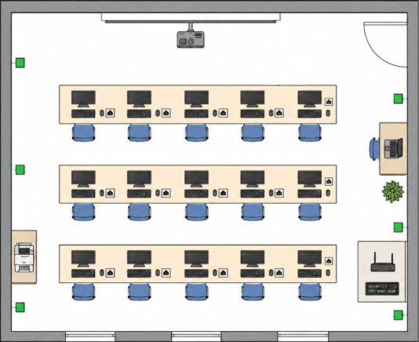

# Tasca 01\. Analitzar necessitats clients

1- Pla d'Infraestructura: Croquis de l'aula amb la distribució dels equips i punts de xarxa.

# **1\. Anàlisi de Necessitats**

### **Anàlisi de l’espai i la xarxa**

- L’aula està pensada per a 15 alumnes i 1 professor, per tant cal preparar un total de 16 llocs de treball. A més, també s’ha de tenir en compte la connexió de la impressora i la resta d’elements de xarxa.  
- Pel que fa a la connectivitat, es necessiten 17 punts de xarxa cablejats: un per a cada lloc de treball i un per a la impressora. Tots aquests punts es connectaran a un switch de 24 ports, que permetrà tenir ports disponibles per a futures ampliacions. També s’inclou un router WiFi 6 per oferir connexió sense fils als dispositius que ho necessitin.

### **Perfils d’usuari**

- **Perfil de disseny gràfic:**  
  Aquest perfil està format per **5 usuaris** que necessiten equips més potents, ja que treballaran amb programes de disseny, edició d’imatges o tasques gràfiques. Per aquest motiu, s’han pressupostat ordinadors amb processadors més potents, més memòria RAM, targeta gràfica dedicada i monitors de més polzades.  
- **Perfil d’ofimàtica:**  
  Aquest perfil està format per **10 usuaris** que faran tasques més bàsiques, com navegar per internet, utilitzar documents, fulls de càlcul, correu electrònic i altres eines d’oficina. En aquest cas, es poden utilitzar equips més senzills, com thin clients, mini PCs o ordinadors d’oficina, amb monitors més simples.

# **2\. Selecció de Hardware** 

2\. Inventari Detallat: Taula amb marques, models i preus de tot el maquinari proposat.

### **Opció A: Inventari Eco/Lliure** 

| Article | Marca i Model | Quantitat | Preu Unitari | Total |
| :---: | :---: | :---: | :---: | :---: |
| **PC Disseny Gràfic**  | [STGsivir PC Gaming, Ordenador de Sobremesa Gaming, Intel Core i7 hasta 3.9GHz, AMD Radeon RX 580 16GB, 16GB RAM,512GB SSD,WiFi 6,BT5.0,RGB Ventiladores x3,Windows11 Pro](https://www.amazon.es/STGsivir-Ordenador-Sobremesa-Ventiladores-Windows11/dp/B0CDQB5X2B/ref=sr_1_2?__mk_es_ES=%C3%85M%C3%85%C5%BD%C3%95%C3%91&crid=82BFAQY0RG1U&dib=eyJ2IjoiMSJ9.-BCVwF_AzjGIyjYtvGZs3JhA-DSNcE5zPCL1svzhCK56xOv2dHhn0-jVRkuFHXIfbZSdq67vgKWWRhnm2OSVJ1rj4k9FYwdwww-TYAcvaryIbM904tdQX0s2zGhEjDkXS5xkqXiJ-WgGwLHGhXj4H5RG0pBoiIxSWH6hl0cKv0dpZP7mYSs3hsUNLBqSRXNpYDwp6qqd4Lf1qiBel6K6HTMfXvctXZp6v0taTeFTd455a1QNxy1YzX_bClPbrmkv8PpE08i18vDmKnsMbD0XmRS5x9n0TRPJ6ecdU4Tihk0.v2Eh4OQThxImv8E4mw2g8-uxq06_QYzkr7VC-gyPBBM&dib_tag=se&keywords=pc%2Bpara%2Bdise%C3%B1o%2Bgrafico&qid=1778749075&refinements=p_36%3A-72000&rnid=9733333031&s=computers&sprefix=pc%2Bpara%2Bdisse%C3%B1o%2Bgrafico%2Ccomputers%2C134&sr=1-2&th=1)  | 5 | 549,99 € | 2.749,95 € |
| **Thin Client** | [PC Ultra Slim HP EliteDesk 800 G1 USDT Core i5-4570s 3.40 GHz 16 GB 240 GB SSD DVD-rw](https://www.amazon.es/HP-EliteDesk-i5-4570s-Reacondicionado-Certificado/dp/B07ZTR1K7F/ref=sr_1_1_sspa?__mk_es_ES=%C3%85M%C3%85%C5%BD%C3%95%C3%91&crid=3QRGM6EFKJQWV&dib=eyJ2IjoiMSJ9.sXRqAC6Nn8dDPalAMzu61417JILNKH-GG_ohBrdrGSvf7wKpZmlY631yqLluJUQVVJA6bJZ6zih1ACbX8y0daXF0OJZrcOXrzDJAHNQ3zRzqP5F1bExbNscqBD_i7361-7LHVAtnWIIzXUhh8TiWGzRh5Rtm2H2I4Zbu3EIRnfeX0C1J_KMOF8xvZiKuBjhc658Q0hMoxEfgP2XGYFIGnhD7ed1HdOo1EP282te4qv8QRI3fKwG8FJNfby4OBWwtqXGIFkzV7liE11brCgMBybwjcDIYIhMEngKmWCqBrso.aWIPmGrquuLH0EHGigN-OLlnThugfy2z4FNqoH-4-94&dib_tag=se&keywords=thin+client&qid=1778747722&sprefix=thin+clien%2Caps%2C93&sr=8-1-spons&aref=iu6hfJrGhf&sp_csd=d2lkZ2V0TmFtZT1zcF9hdGY&psc=1)  | 10 | 164,99 | 1.649,9 € |
| **Portatil Profe** | [Portátil Alurin Flex Advance AMD Ryzen 7-5825U 15.6"/ 16GB/500GB/Windows 11 Home](https://www.pccomponentes.com/portatil-alurin-flex-advance-amd-ryzen-7-5825u-156-16gb-500gb-windows-11-home?srsltid=AfmBOooF3N6IuzLRSFgyBUZ8wJlsn44AkCbHo3pwq4UrRcu_-1q34iNr)  | 1  | 489,99 € | 489,99 € |
| **Monitor** | [AOC Monitor E2270SWN \- 22" Full HD, 60 Hz, TN, VESA, 1920x1080, 200 cd/m, D-SUB](https://www.amazon.es/AOC-E2270SWN-Monitor-color-negro/dp/B00DULAVPA/ref=sr_1_15?__mk_es_ES=%C3%85M%C3%85%C5%BD%C3%95%C3%91&crid=32HBWXLTDIADZ&dib=eyJ2IjoiMSJ9.6MpMBWJSscmTfht4_pnRpUkpp18V4t60DdeF-D5sb2QIHjRp8CRTj-XFIwaL4SHfm1iXEK1xnIrSXTHwu1Rpss5Uapj8r_7a5OUq50hWrzuJc_rRadZ8r1JHDyVhJ6FSw6oEJ_nSphMfPc1UUZu_4NN0SsSpVMCHkQCngtRcWhH8l9M8r4x0DaEWpwS6kBxbTiLdpEt4XrJPHP3OHHWCvwW9JnK-Qa_gtRFoJRoNZkgONguNcpMhEEVkghP4Z4yvk4RyrJ-_pa9VN7yq4rW2JAwKm0Ph4oCIiHXJMphOx7M.4Ooi9LIXIFevBCgZB4iWCUopxB5_qGfUiQItHmL16WA&dib_tag=se&keywords=monitor%2Bde%2Boficina%2B24%2Bpulgadas&qid=1778745896&refinements=p_36%3A-7400&rnid=1323854031&sprefix=monitor%2Bde%2Boficina%2B24%2Bpulgadas%2Caps%2C79&sr=8-15&th=1)  | 15 | 62,90 € | 943,5 € |
| **Teclat i Ratolí** | [Teclado \+ HP 230 inalámbrico membrana Layout ES ratón incluido negro](https://www.pccomponentes.com/teclado-hp-230-inalambrico-membrana-layout-es-raton-incluido-negro)  | 16 | 51,53 € | 824,48 € |
| **Projector** | [Proyector BenQ MW560C WXGA 4000 Lúmenes 100" Lámpara DLP SmartEco](https://www.pccomponentes.com/proyector-benq-mw560c-wxga-4000-lumenes-100-lampara-dlp-smarteco?s_kwcid=AL!14405!3!779399293576!!!g!374727798899!&gad_source=1&gad_campaignid=23138169549&gclid=CjwKCAjw5ZXQBhBdEiwAI5XVWbYdeeaDS1TUMalbQlEnwIKkwqb5LnRoZYhs0vzqGj66k9jp75_KoRoC57oQAvD_BwE)  | 1 | 389 € | 389 € |
| **Impressora** | [HP LaserJet Enterprise M507dn Impresora Láser Monocromo Dúplex](https://www.pccomponentes.com/hp-laserjet-enterprise-m507dn-impresora-laser-monocromo-duplex)  | 1 | 499 € | 499 € |
| **Switch** | [Zyxel Switch Gigabit de 24 Puertos Gestión Inteligente 24x GbE VLAN, IGMP, QoS](https://www.amazon.es/Zyxel-GS1900-24E-EU0103F-Gestionado-Gigabit-Ethernet/dp/B09Q97VDPX/ref=sr_1_3_mod_primary_new?__mk_es_ES=%C3%85M%C3%85%C5%BD%C3%95%C3%91&crid=3EOKSEXIAWS8J&dib=eyJ2IjoiMSJ9._FloxTBGP9EfeSh8weQ52dZFJ_nuvxt9wmQhHXjS8mM6RZu_SMmVr7DXS-S5Vc-G1GcPuaz9a8EmX8D7bQr7_k-MasQ9XmcbsyCvOQDV_Uh89uu6vdYqWPNTp124K04Y9BTkhM3U1n_Th0GpmpubOPPNba7EbFZa7cT98hGiD61GYS4R8Ek5AiiPGyx40MVPFzCNQWFEfLsUs2KAgmJ5aHZ_S_Pe7hQ46B9x6sxMVet5xb8CqOfXF-MlvKfuzpjLqUJcplQ_VYHjXJQWAP_bV-RM2p5SCrBy4-KL2bGkbYc.QWFJ1bqd2TNFf3RahtZi2-hvwUPaTzRyTkV-f-YCYyY&dib_tag=se&keywords=switch%2B24%2Bport%2Bmanaged&qid=1778746466&sbo=RZvfv%2F%2FHxDF%2BO5021pAnSA%3D%3D&sprefix=switch%2B24%2Bport%2Bmanaged%2Caps%2C91&sr=8-3&th=1) | 1 | 97 ,90€ | 97,90 € |
| **Patch Panel** | [deleyCON CAT6 Patch Panel El Panel de Corrección 24 Puertos 24x RJ45 Blindado](http://amazon.es/deleyCON-Panel-conexiones-puertos-CAT6/dp/B01N5OB4B2/ref=sr_1_6?__mk_es_ES=ÅMÅŽÕÑ&crid=269I7OKF3W80J&dib=eyJ2IjoiMSJ9.h71Y-yrRcZDKqVdgkvaR_Z313ZaWS0Pr9YzcAj6NooU5qS9A40wLpFSEni9JV9WCOfxdWn3g-ssNKefQL0-V4xAufJNbQIDBmTx49u_5EM6Ok-ABgsWjOeO_ITiLAw4QRGbMt_Fti-2RpV1DEFVA8TRiu-Onc4SnoDnkmskwi3m2Hf-dBzYXHY7OIWcfQfbDqF9B8X-p36wMNZtwkWFqKFcjJO-edh2slcOV82uK2aYqGmGk1BiIA_Eroe_x2QARNrgd1bi60fq0xSyhzoHDCSQltXUvvfWEfmzGNm5f3EY.HgbHw6WexSQlFnQLq5TICTzV0mJMBNRySTk5Pr_52Mw&dib_tag=se&keywords=deleyCON+CAT6+Patch+Panel&qid=1778748447&sprefix=deleycon+cat6+patch+panel%2Caps%2C80&sr=8-6) | 1 | 55,15 € | 55,15 € |
| **Router** | [TP-Link Archer AX18 \- AX1500 Router Wi-Fi 6, Doble Banda (5GHz 1201Mbps/2.4GHz 300Mbps), 4 Puertos Gigabit,](https://www.amazon.es/Neuvo-TP-Link-Archer-AX18-Configuraci%C3%B3n/dp/B0CFYJSQ62/ref=sr_1_10?__mk_es_ES=%C3%85M%C3%85%C5%BD%C3%95%C3%91&crid=1655Y801J1RBR&dib=eyJ2IjoiMSJ9.T2ld8oKj22hUTrxHo2X34TEIgQy30KyOdic4kh3UQTfJUZl83rcfWhLPI0Ja8-RvfqboLXb2vPeFDEKu05Z5JXLl9e0phuJmU_h0_ipb3TKRMtwDgJ22bY7PpLnYH-onBbcbmpTcdlMtDjwJcL33Ac0JQO-jsyTTVZTIJ_C0Gwrldjdx5at3bCWcKv07v6YFlBF9nYk7VZsWeu9QGwqelhgm9DglJCN431n5_2J7D9GgVpgtxsyBUce1GdDvhRHHJrEOKbXEisy-tMgZ64f1KBr688AnRBRTjf2bpNZYO2Q.MKCpY4G0BMJgsBLiydCKheaOb-jTbGDvQKFcglDHyKE&dib_tag=se&keywords=router+oficina&qid=1778746077&sprefix=router+oficina%2Caps%2C84&sr=8-10)  | 1 | 44,99 € | 44,99 € |
| **TOTAL MAQUINARI** |  |  |  | **8.233,85€** |

### **Opció B: Inventari Estàndard/Comercial**

| Article | Marca i Model | Quantitat | Preu Unitari | Total |
| :---: | :---: | ----- | :---: | :---: |
| **PC Disseny Gràfic**  | [PcCom Lite Intel Core i5-12400F / 16GB / 1TB SSD / RTX 3050](https://www.pccomponentes.com/pccom-lite-intel-core-i5-12400f-16gb-1tb-ssd-rtx-3050)  | 5 | 869 € | 4345 € |
| **PC Oficina**  | [Pc Sobremasa Profesional Ordenedaor Sobremasa Nuevo Windows 11 Pro con Core i5 16 GB RAM WiFi \- 240 GB SSD \+ 1000](https://www.amazon.es/Sobremasa-Profesional-Ordenedaor-Nuevo-Windows/dp/B0GPT3BGCG/ref=sr_1_9?__mk_es_ES=%C3%85M%C3%85%C5%BD%C3%95%C3%91&crid=2E2HWCRK05LE5&dib=eyJ2IjoiMSJ9.zMPJIALPwwNCPebSHl9TekXjwXqT1HGojEO06fJXy58sr7rebXVgZ_FZ6HARUuH0VYN2epCebPyAPek9JIs-5HC8PxKf_qlV5PY83zf-ClRIdiDf6ZaZbWEW976k4SQPQyze-kO_S4xmClpJHItl4ptlhx43lu0Zo0ZaWvvc05H6vkgSkSf5ofSv-1Dqqdtjwa5MK3QQRa66JRB5sxaoqyTUczvizO9z8vFwrduhF5vg7vRXLJ77faL-IFg0AU34-P2a74ovi2BbF3oTEKgWeDpx2BwUdpK-uVeaQGjqObE.G4MfAqvdYj7DkxCmL1Q6xNsIZO9-j3frnry_zKN7jbk&dib_tag=se&keywords=pro+desk+pc&qid=1778747089&refinements=p_n_condition-type%3A15144009031&rnid=15144007031&sprefix=pro+desk+pc%2Caps%2C89&sr=8-9)   | 10 | 299,90 € | 2999 € |
| **Portatil Profe** | [Portátil Alurin Flex Advance AMD Ryzen 7-5825U 15.6"/ 16GB/500GB/Windows 11 Home](https://www.pccomponentes.com/portatil-alurin-flex-advance-amd-ryzen-7-5825u-156-16gb-500gb-windows-11-home?srsltid=AfmBOooF3N6IuzLRSFgyBUZ8wJlsn44AkCbHo3pwq4UrRcu_-1q34iNr)  | 1  | 489,99 € | 489,99 € |
| **Monitor Disseny Gràfic** | [Philips 27E1N1100A Monitor 27 Pulgadas FHD, 120Hz, IPS, 1 ms MPRT, Adaptive Sync., Altavoces (1920x1080, 1x HDMI 1.4), Negro](https://www.amazon.es/Philips-27E1N1100A-Integrado-Respuesta-1920x1080/dp/B0CX9CVS9Q/ref=sr_1_7?__mk_es_ES=%C3%85M%C3%85%C5%BD%C3%95%C3%91&crid=29EUDG7GM11YG&dib=eyJ2IjoiMSJ9.XZq7gCujSQ9g4adZVFyWv7_xTI3xytCR3LSJEboOrm2fEn0vcsUburSCNo7IYjgYrzebFLyDumS7wGDZ9wvv-jvMRc4YllygY4WtOpA8f4ibs4ME9LLWdbtImjYU3X4RnZ7VK6sHnmzyUIXURt3ute95DTUAPbLMPj5yTtKpDurM3TWiVkCptrBdLlriSJLfZKbimZjO6lKTPDXWN88yMJ5oCU23TlVi7bq0SbrHcI2QTNz6eHZ-Z0RwbW7eCzhNEnq5ljuJxXWNklEF6F32PCxCVfE_tHPDtGa2YjGeiNo.kx9LtGYrK1wwarYJS7NZ1IG-APViDgDRGR4SwsABK3E&dib_tag=se&keywords=monitor%2Boficina&qid=1778745746&sprefix=monitor%2Boficina%2Caps%2C91&sr=8-7&th=1)  | 5 | 89 € | 445  € |
| **Monitor Oficina** | [AOC Monitor E2270SWN \- 22" Full HD, 60 Hz, TN, VESA, 1920x1080, 200 cd/m, D-SUB](https://www.amazon.es/AOC-E2270SWN-Monitor-color-negro/dp/B00DULAVPA/ref=sr_1_15?__mk_es_ES=%C3%85M%C3%85%C5%BD%C3%95%C3%91&crid=32HBWXLTDIADZ&dib=eyJ2IjoiMSJ9.6MpMBWJSscmTfht4_pnRpUkpp18V4t60DdeF-D5sb2QIHjRp8CRTj-XFIwaL4SHfm1iXEK1xnIrSXTHwu1Rpss5Uapj8r_7a5OUq50hWrzuJc_rRadZ8r1JHDyVhJ6FSw6oEJ_nSphMfPc1UUZu_4NN0SsSpVMCHkQCngtRcWhH8l9M8r4x0DaEWpwS6kBxbTiLdpEt4XrJPHP3OHHWCvwW9JnK-Qa_gtRFoJRoNZkgONguNcpMhEEVkghP4Z4yvk4RyrJ-_pa9VN7yq4rW2JAwKm0Ph4oCIiHXJMphOx7M.4Ooi9LIXIFevBCgZB4iWCUopxB5_qGfUiQItHmL16WA&dib_tag=se&keywords=monitor%2Bde%2Boficina%2B24%2Bpulgadas&qid=1778745896&refinements=p_36%3A-7400&rnid=1323854031&sprefix=monitor%2Bde%2Boficina%2B24%2Bpulgadas%2Caps%2C79&sr=8-15&th=1)  | 10 | 62,90 | 629 € |
| **Teclat i Ratolí** | [Teclado \+ HP 230 inalámbrico membrana Layout ES ratón incluido negro](https://www.pccomponentes.com/teclado-hp-230-inalambrico-membrana-layout-es-raton-incluido-negro)  | 16 | 51,53 € | 824,48 € |
| **Projector** | [Proyector BenQ MW560C WXGA 4000 Lúmenes 100" Lámpara DLP SmartEco](https://www.pccomponentes.com/proyector-benq-mw560c-wxga-4000-lumenes-100-lampara-dlp-smarteco?s_kwcid=AL!14405!3!779399293576!!!g!374727798899!&gad_source=1&gad_campaignid=23138169549&gclid=CjwKCAjw5ZXQBhBdEiwAI5XVWbYdeeaDS1TUMalbQlEnwIKkwqb5LnRoZYhs0vzqGj66k9jp75_KoRoC57oQAvD_BwE)  | 1 | 389 € | 389 € |
| **Impressora** | [HP LaserJet Enterprise M507dn Impresora Láser Monocromo Dúplex](https://www.pccomponentes.com/hp-laserjet-enterprise-m507dn-impresora-laser-monocromo-duplex)  | 1 | 499 € | 499 € |
| **Switch** | [Zyxel Switch Gigabit de 24 Puertos Gestión Inteligente 24x GbE Sin Ventilador VLAN]((https://www.amazon.es/Zyxel-GS1900-24E-EU0103F-Gestionado-Gigabit-Ethernet/dp/B09Q97VDPX/ref=sr_1_3_mod_primary_new?__mk_es_ES=%C3%85M%C3%85%C5%BD%C3%95%C3%91&crid=3EOKSEXIAWS8J&dib=eyJ2IjoiMSJ9._FloxTBGP9EfeSh8weQ52dZFJ_nuvxt9wmQhHXjS8mM6RZu_SMmVr7DXS-S5Vc-G1GcPuaz9a8EmX8D7bQr7_k-MasQ9XmcbsyCvOQDV_Uh89uu6vdYqWPNTp124K04Y9BTkhM3U1n_Th0GpmpubOPPNba7EbFZa7cT98hGiD61GYS4R8Ek5AiiPGyx40MVPFzCNQWFEfLsUs2KAgmJ5aHZ_S_Pe7hQ46B9x6sxMVet5xb8CqOfXF-MlvKfuzpjLqUJcplQ_VYHjXJQWAP_bV-RM2p5SCrBy4-KL2bGkbYc.QWFJ1bqd2TNFf3RahtZi2-hvwUPaTzRyTkV-f-YCYyY&dib_tag=se&keywords=switch%2B24%2Bport%2Bmanaged&qid=1778746466&sbo=RZvfv%2F%2FHxDF%2BO5021pAnSA%3D%3D&sprefix=switch%2B24%2Bport%2Bmanaged%2Caps%2C91&sr=8-3&th=1))  | 1 | 97 ,90€ | 97,90 € |
| **Patch Panel** | [deleyCON CAT6 Patch Panel El Panel de Corrección 24 Puertos 24x RJ45 Blindado](http://amazon.es/deleyCON-Panel-conexiones-puertos-CAT6/dp/B01N5OB4B2/ref=sr_1_6?__mk_es_ES=ÅMÅŽÕÑ&crid=269I7OKF3W80J&dib=eyJ2IjoiMSJ9.h71Y-yrRcZDKqVdgkvaR_Z313ZaWS0Pr9YzcAj6NooU5qS9A40wLpFSEni9JV9WCOfxdWn3g-ssNKefQL0-V4xAufJNbQIDBmTx49u_5EM6Ok-ABgsWjOeO_ITiLAw4QRGbMt_Fti-2RpV1DEFVA8TRiu-Onc4SnoDnkmskwi3m2Hf-dBzYXHY7OIWcfQfbDqF9B8X-p36wMNZtwkWFqKFcjJO-edh2slcOV82uK2aYqGmGk1BiIA_Eroe_x2QARNrgd1bi60fq0xSyhzoHDCSQltXUvvfWEfmzGNm5f3EY.HgbHw6WexSQlFnQLq5TICTzV0mJMBNRySTk5Pr_52Mw&dib_tag=se&keywords=deleyCON+CAT6+Patch+Panel&qid=1778748447&sprefix=deleycon+cat6+patch+panel%2Caps%2C80&sr=8-6) | 1 | 55,15 € | 55,15 € |
| **Router** | [TP-Link Archer AX18 \- AX1500 Router Wi-Fi 6, Doble Banda (5GHz 1201Mbps/2.4GHz 300Mbps), 4 Puertos Gigabit,](https://www.amazon.es/Neuvo-TP-Link-Archer-AX18-Configuraci%C3%B3n/dp/B0CFYJSQ62/ref=sr_1_10?__mk_es_ES=%C3%85M%C3%85%C5%BD%C3%95%C3%91&crid=1655Y801J1RBR&dib=eyJ2IjoiMSJ9.T2ld8oKj22hUTrxHo2X34TEIgQy30KyOdic4kh3UQTfJUZl83rcfWhLPI0Ja8-RvfqboLXb2vPeFDEKu05Z5JXLl9e0phuJmU_h0_ipb3TKRMtwDgJ22bY7PpLnYH-onBbcbmpTcdlMtDjwJcL33Ac0JQO-jsyTTVZTIJ_C0Gwrldjdx5at3bCWcKv07v6YFlBF9nYk7VZsWeu9QGwqelhgm9DglJCN431n5_2J7D9GgVpgtxsyBUce1GdDvhRHHJrEOKbXEisy-tMgZ64f1KBr688AnRBRTjf2bpNZYO2Q.MKCpY4G0BMJgsBLiydCKheaOb-jTbGDvQKFcglDHyKE&dib_tag=se&keywords=router+oficina&qid=1778746077&sprefix=router+oficina%2Caps%2C84&sr=8-10)  | 1 | 44,99 € | 44,99 € |
| **Auriculars** | [Logitech H390 Auriculares Estéreo con Micrófono con Supresión de Ruido USB-A funciona con Chromebook](https://www.pccomponentes.com/logitech-h390-auriculares-estereo-con-microfono-con-supresion-de-ruido-usb-a-funciona-con-chromebook)  | 16 | 29.,99 € | 479,84 € |
| **TOTAL MAQUINARI** |  |  |  | **11.298,35€** |

# **3\. Comparativa/Selecció de Software** 

3\. Informe Comparatiu de Software: Un document argumentatiu que analitzi els pros i contres de les dues rutes (Lliure vs. Comercial) adaptat al context de l'ONG.

| Comparativa directa  |  |  |
| :---- | :---- | :---- |
| Criteri  | Ruta Lliure / Eco  | Ruta Comercial  |
| Cost inicial  | Molt baix en software  | Més alt per llicències i subscripcions  |
| Cost anual  | Reduït | Elevat i recurrent  |
| Compatibilitat entre els equips | S’adapta millor als equips antics o menys potents, pensat per Linux  | S’adapta millor als equips nous i més potents, pensat per Windows |
| Facilitat per a usuaris  | Requereix formació inicial  | Més familiar per a la majoria  |
| Ofimàtica  | LibreOffice, Google Workspace ONG  | Microsoft 365  |
| Disseny gràfic  | GIMP, Inkscape, Krita, Scribus  | Adobe Photoshop, Illustrator, InDesign  |
| Suport tècnic  | Comunitat o suport contractat  | Suport oficial del proveïdor  |
| Dependència de proveïdors  | Baixa  | Alta  |
| Adequació a una ONG  | Molt bona si es prioritza l’estalvi  | Bona si es prioritza compatibilitat i professionalització  |

---
---

Després de comparar les dues opcions, es pot veure que la ruta lliure és més adequada si l’ONG vol reduir costos i aprofitar millor els equips menys potents. Aquesta opció permet utilitzar programes gratuïts com LibreOffice, GIMP, Inkscape, Krita o Scribus, sense haver de pagar llicències. Tot i això, pot requerir una mica de formació inicial per als usuaris.

En canvi, la ruta comercial és més fàcil d’utilitzar per a la majoria de persones, perquè programes com Microsoft 365 o Adobe Creative Cloud són més coneguts i utilitzats en entorns professionals. El problema principal és que tenen un cost més alt i normalment funcionen amb subscripcions.

Per aquest motiu, la millor opció per a l’ONG seria una solució mixta: utilitzar software lliure per a la majoria d’equips i només contractar software comercial en els casos on sigui realment necessari, com en tasques de disseny gràfic professional o compatibilitat amb documents externs.

# **4\. Pressupost sol·licitat** 

## 1. Maquinari (Hardware)

| Article | Model | Quant. | Unitari | Total |
|---|---|---:|---:|---:|
| PC Disseny Gràfic | [PcCom Lite i5-12400F / 16GB / 1TB / RTX 3050](https://www.pccomponentes.com/pccom-lite-intel-core-i5-12400f-16gb-1tb-ssd-rtx-3050) | 5 | 869,00 € | 4.345,00 € |
| PC Oficina | [Profesional i5 / 16GB RAM / 240GB SSD + 1TB](https://www.amazon.es/Sobremasa-Profesional-Ordenedaor-Nuevo-Windows/dp/B0GPT3BGCG/ref=sr_1_9?__mk_es_ES=%C3%85M%C3%85%C5%BD%C3%95%C3%91&crid=2E2HWCRK05LE5&dib=eyJ2IjoiMSJ9.zMPJIALPwwNCPebSHl9TekXjwXqT1HGojEO06fJXy58sr7rebXVgZ_FZ6HARUuH0VYN2epCebPyAPek9JIs-5HC8PxKf_qlV5PY83zf-ClRIdiDf6ZaZbWEW976k4SQPQyze-kO_S4xmClpJHItl4ptlhx43lu0Zo0ZaWvvc05H6vkgSkSf5ofSv-1Dqqdtjwa5MK3QQRa66JRB5sxaoqyTUczvizO9z8vFwrduhF5vg7vRXLJ77faL-IFg0AU34-P2a74ovi2BbF3oTEKgWeDpx2BwUdpK-uVeaQGjqObE.G4MfAqvdYj7DkxCmL1Q6xNsIZO9-j3frnry_zKN7jbk&dib_tag=se&keywords=pro+desk+pc&qid=1778747089&refinements=p_n_condition-type%3A15144009031&rnid=15144007031&sprefix=pro+desk+pc%2Caps%2C89&sr=8-9) | 10 | 299,90 € | 2.999,00 € |
| Portàtil Professor | [Alurin Flex Advance Ryzen 7 / 16GB / 500GB](https://www.pccomponentes.com/portatil-alurin-flex-advance-amd-ryzen-7-5825u-156-16gb-500gb-windows-11-home?srsltid=AfmBOooF3N6IuzLRSFgyBUZ8wJlsn44AkCbHo3pwq4UrRcu_-1q34iNr) | 1 | 489,99 € | 489,99 € |
| Monitor Disseny | [Philips 27" FHD 120Hz IPS](https://www.amazon.es/Philips-27E1N1100A-Integrado-Respuesta-1920x1080/dp/B0CX9CVS9Q/ref=sr_1_7?__mk_es_ES=%C3%85M%C3%85%C5%BD%C3%95%C3%91&crid=29EUDG7GM11YG&dib=eyJ2IjoiMSJ9.XZq7gCujSQ9g4adZVFyWv7_xTI3xytCR3LSJEboOrm2fEn0vcsUburSCNo7IYjgYrzebFLyDumS7wGDZ9wvv-jvMRc4YllygY4WtOpA8f4ibs4ME9LLWdbtImjYU3X4RnZ7VK6sHnmzyUIXURt3ute95DTUAPbLMPj5yTtKpDurM3TWiVkCptrBdLlriSJLfZKbimZjO6lKTPDXWN88yMJ5oCU23TlVi7bq0SbrHcI2QTNz6eHZ-Z0RwbW7eCzhNEnq5ljuJxXWNklEF6F32PCxCVfE_tHPDtGa2YjGeiNo.kx9LtGYrK1wwarYJS7NZ1IG-APViDgDRGR4SwsABK3E&dib_tag=se&keywords=monitor%2Boficina&qid=1778745746&sprefix=monitor%2Boficina%2Caps%2C91&sr=8-7&th=1) | 5 | 89,00 € | 445,00 € |
| Monitor Oficina | [AOC 22" Full Hd 60Hz](https://www.amazon.es/AOC-E2270SWN-Monitor-color-negro/dp/B00DULAVPA/ref=sr_1_15?__mk_es_ES=%C3%85M%C3%85%C5%BD%C3%95%C3%91&crid=32HBWXLTDIADZ&dib=eyJ2IjoiMSJ9.6MpMBWJSscmTfht4_pnRpUkpp18V4t60DdeF-D5sb2QIHjRp8CRTj-XFIwaL4SHfm1iXEK1xnIrSXTHwu1Rpss5Uapj8r_7a5OUq50hWrzuJc_rRadZ8r1JHDyVhJ6FSw6oEJ_nSphMfPc1UUZu_4NN0SsSpVMCHkQCngtRcWhH8l9M8r4x0DaEWpwS6kBxbTiLdpEt4XrJPHP3OHHWCvwW9JnK-Qa_gtRFoJRoNZkgONguNcpMhEEVkghP4Z4yvk4RyrJ-_pa9VN7yq4rW2JAwKm0Ph4oCIiHXJMphOx7M.4Ooi9LIXIFevBCgZB4iWCUopxB5_qGfUiQItHmL16WA&dib_tag=se&keywords=monitor%2Bde%2Boficina%2B24%2Bpulgadas&qid=1778745896&refinements=p_36%3A-7400&rnid=1323854031&sprefix=monitor%2Bde%2Boficina%2B24%2Bpulgadas%2Caps%2C79&sr=8-15&th=1) | 10 | 62,90 € | 629,00 € |
| Teclat i Ratolí | [HP 230 Inalàmbric (Combo)](https://www.pccomponentes.com/teclado-hp-230-inalambrico-membrana-layout-es-raton-incluido-negro) | 16 | 51,53 € | 824,48 € |
| Projector | [BenQ MW560C WXGA 4000 Lm](https://www.pccomponentes.com/proyector-benq-mw560c-wxga-4000-lumenes-100-lampara-dlp-smarteco?s_kwcid=AL!14405!3!779399293576!!!g!374727798899!&gad_source=1&gad_campaignid=23138169549&gclid=CjwKCAjw5ZXQBhBdEiwAI5XVWbYdeeaDS1TUMalbQlEnwIKkwqb5LnRoZYhs0vzqGj66k9jp75_KoRoC57oQAvD_BwE) | 1 | 389,00 € | 389,00 € |
| Impressora | [HP LaserJet Enterprise M507dn](https://www.pccomponentes.com/hp-laserjet-enterprise-m507dn-impresora-laser-monocromo-duplex) | 1 | 499,00 € | 499,00 € |
| Switch | [Zyxel Gigabit 24 ports (Gestió)](https://www.amazon.es/Zyxel-GS1900-24E-EU0103F-Gestionado-Gigabit-Ethernet/dp/B09Q97VDPX/ref=sr_1_3_mod_primary_new?__mk_es_ES=%C3%85M%C3%85%C5%BD%C3%95%C3%91&crid=3EOKSEXIAWS8J&dib=eyJ2IjoiMSJ9._FloxTBGP9EfeSh8weQ52dZFJ_nuvxt9wmQhHXjS8mM6RZu_SMmVr7DXS-S5Vc-G1GcPuaz9a8EmX8D7bQr7_k-MasQ9XmcbsyCvOQDV_Uh89uu6vdYqWPNTp124K04Y9BTkhM3U1n_Th0GpmpubOPPNba7EbFZa7cT98hGiD61GYS4R8Ek5AiiPGyx40MVPFzCNQWFEfLsUs2KAgmJ5aHZ_S_Pe7hQ46B9x6sxMVet5xb8CqOfXF-MlvKfuzpjLqUJcplQ_VYHjXJQWAP_bV-RM2p5SCrBy4-KL2bGkbYc.QWFJ1bqd2TNFf3RahtZi2-hvwUPaTzRyTkV-f-YCYyY&dib_tag=se&keywords=switch%2B24%2Bport%2Bmanaged&qid=1778746466&sbo=RZvfv%2F%2FHxDF%2BO5021pAnSA%3D%3D&sprefix=switch%2B24%2Bport%2Bmanaged%2Caps%2C91&sr=8-3&th=1) | 1 | 97,90 € | 97,90 € |
| Patch Panel | [DeleyCON CAT6 24 ports](http://amazon.es/deleyCON-Panel-conexiones-puertos-CAT6/dp/B01N5OB4B2/ref=sr_1_6?__mk_es_ES=ÅMÅŽÕÑ&crid=269I7OKF3W80J&dib=eyJ2IjoiMSJ9.h71Y-yrRcZDKqVdgkvaR_Z313ZaWS0Pr9YzcAj6NooU5qS9A40wLpFSEni9JV9WCOfxdWn3g-ssNKefQL0-V4xAufJNbQIDBmTx49u_5EM6Ok-ABgsWjOeO_ITiLAw4QRGbMt_Fti-2RpV1DEFVA8TRiu-Onc4SnoDnkmskwi3m2Hf-dBzYXHY7OIWcfQfbDqF9B8X-p36wMNZtwkWFqKFcjJO-edh2slcOV82uK2aYqGmGk1BiIA_Eroe_x2QARNrgd1bi60fq0xSyhzoHDCSQltXUvvfWEfmzGNm5f3EY.HgbHw6WexSQlFnQLq5TICTzV0mJMBNRySTk5Pr_52Mw&dib_tag=se&keywords=deleyCON+CAT6+Patch+Panel&qid=1778748447&sprefix=deleycon+cat6+patch+panel%2Caps%2C80&sr=8-6) | 1 | 55,15 € | 55,15 € |
| Router | [TP-Link Archer AX1800 WiFi-6](https://www.amazon.es/Neuvo-TP-Link-Archer-AX18-Configuraci%C3%B3n/dp/B0CFYJSQ62/ref=sr_1_10?__mk_es_ES=%C3%85M%C3%85%C5%BD%C3%95%C3%91&crid=1655Y801J1RBR&dib=eyJ2IjoiMSJ9.T2ld8oKj22hUTrxHo2X34TEIgQy30KyOdic4kh3UQTfJUZl83rcfWhLPI0Ja8-RvfqboLXb2vPeFDEKu05Z5JXLl9e0phuJmU_h0_ipb3TKRMtwDgJ22bY7PpLnYH-onBbcbmpTcdlMtDjwJcL33Ac0JQO-jsyTTVZTIJ_C0Gwrldjdx5at3bCWcKv07v6YFlBF9nYk7VZsWeu9QGwqelhgm9DglJCN431n5_2J7D9GgVpgtxsyBUce1GdDvhRHHJrEOKbXEisy-tMgZ64f1KBr688AnRBRTjf2bpNZYO2Q.MKCpY4G0BMJgsBLiydCKheaOb-jTbGDvQKFcglDHyKE&dib_tag=se&keywords=router+oficina&qid=1778746077&sprefix=router+oficina%2Caps%2C84&sr=8-10) | 1 | 44,99 € | 44,99 € |
| Auriculars | [Logitech H390 USB](https://www.pccomponentes.com/logitech-h390-auriculares-estereo-con-microfono-con-supresion-de-ruido-usb-a-funciona-con-chromebook) | 16 | 29,99 € | 479,84 € |

## 2. Llicències i Serveis

| Concepte | Unitats/Hores | Preu Unit. | Total |
|---|---:|---:|---:|
| Llicències Windows 11 Pro | 15 | 135,00 € | 2.025,00 € |
| Cost de Configuració i Instal·lació (Mà d'obra) | 18 | 56,11 € | 1.010,00 € |
| Microsoft 365 Empresa Estàndar | 16 | 10,80 € | 172,8 € |
| Creative Cloud Pro | 5 | 69 € / mes | 4.140 € / any |

## Resum econòmic

| Concepte | Import |
|---|---:|
| Subtotal Maquinari | 11.298,35 € |
| Llicències i Serveis | 7.347,00 € |
| Base Imposable | 18.645,35 € |
| IVA (21%) | 3.915,52 € |
| **TOTAL FINAL** | **22.560,87 €** |

# **5\. Connectivitat/Pla de manteniment(cas 3\)** 

## **Pla de Manteniment**

Un cop l’aula estigui en marxa, caldrà fer un manteniment bàsic per assegurar que els equips funcionin bé i durin més temps.

### **Tasques principals**

- **Netejar els equips** regularment per evitar pols i sobreescalfament.  
- **Revisar cables i connexions** de xarxa per comprovar que tot funcioni correctament.  
- **Actualitzar el sistema operatiu i els programes** per millorar la seguretat i el rendiment.  
- **Fer còpies de seguretat** dels documents importants de l’ONG.  
- **Controlar la seguretat**, utilitzant contrasenyes segures i comptes separats per a alumnes i professor.  
- **Revisar la xarxa WiFi i el switch** per garantir una connexió estable.

| Freqüència recomanada  |  |
| :---- | :---- |
| **Tasca**  | **Freqüència**  |
| **Neteja dels equips**  | Setmanal  |
| **Revisió de connexions**  | Mensual  |
| **Actualitzacions**  | Mensual  |
| **Còpies de seguretat**  | Setmanal  |
| **Revisió general**  | Trimestral  |

---

[Torna a l'enunciat](README.md)

[Torna a la pàgina principal](../README.md)
